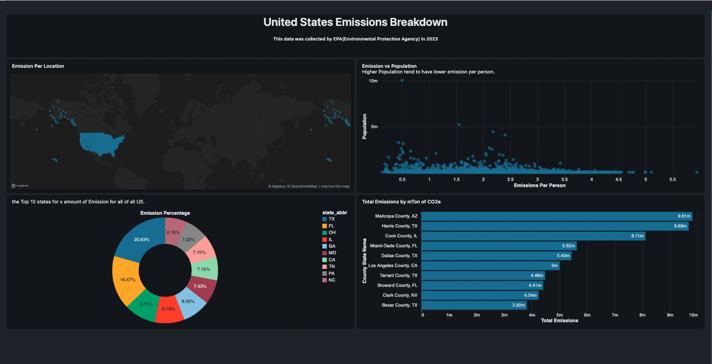

# United States Greenhouse Gas Emissions Dashboard

## Overview

This project analyzes greenhouse gas (GHG) emissions across the United States using EPA environmental data. The dashboard was developed entirely in Databricks SQL and provides insights into emissions distribution at the state and county levels.

The goal of this project was to transform raw emissions data into meaningful visual insights through SQL-based analysis and interactive dashboards.

## Dashboard Features

* Geographic visualization of emissions across the United States
* Emissions per capita analysis
* Top contributing states by total emissions
* County-level emissions comparison
* Interactive filtering and exploration

## Technologies Used

* Databricks SQL
* Databricks Dashboards
* SQL
* Delta Tables

## Data Processing

The dataset contained emission values stored as text with comma separators. SQL transformations were applied to clean and aggregate the data before visualization.

Example:

```sql
SELECT state_abbr,
       SUM(CAST(REPLACE(`GHG emissions mtons CO2e`, ',', '') AS DOUBLE)) AS total_emission
FROM emissions.default.emissions_data
GROUP BY state_abbr;
```

## Key Insights

* Texas is the largest contributor among the analyzed states.
* Emissions are concentrated in a relatively small number of counties.
* Population size does not always correlate directly with emissions per person.
* Geographic analysis helps identify emission hotspots across the United States.

## Dashboard Preview



## Skills Demonstrated

* SQL Data Cleaning
* Data Transformation
* Data Aggregation
* Analytical Query Development
* Dashboard Development
* Data Visualization
* Databricks SQL

